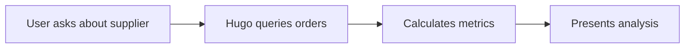

<div align="center">

# ⚡ Voltway ERP - AI-Native Operations Platform

### Intelligent Enterprise Resource Planning for Electric Scooter Manufacturing


**[🚀 Features](#-core-features) • [🤖 Hugo AI](#-hugo-ai---intelligent-automation-engine) • [⚙️ Setup](#%EF%B8%8F-installation--setup) • [📖 Usage](#-usage-guide) • [🏗️ Architecture](#%EF%B8%8F-architecture)**

</div>

---

## 📋 Table of Contents

1. [Project Overview](#-project-overview)
2. [Core Features](#-core-features)
3. [Hugo AI - Intelligent Automation Engine](#-hugo-ai---intelligent-automation-engine)
4. [Installation & Setup](#%EF%B8%8F-installation--setup)
5. [Usage Guide](#-usage-guide)
6. [Architecture](#%EF%B8%8F-architecture)
7. [API Documentation](#-api-documentation)
8. [Technology Stack](#-technology-stack)
9. [Contributing](#-contributing)

---

## 🎯 Project Overview

Voltway ERP is a **next-generation enterprise resource planning system** specifically designed for electric scooter manufacturing operations. Unlike traditional ERPs, Voltway integrates **artificial intelligence at its core** through Hugo AI, an intelligent copilot that automates procurement workflows, analyzes operational data, and enables natural language interactions with your entire operations database.

### Key Highlights

- 🤖 **AI-First Design** - Hugo AI understands context and automates complex workflows
- 📊 **Real-Time Dashboard** - Monitor KPIs, production, and logistics at a glance
- 🔄 **Automated Procurement** - AI-driven reorder suggestions and supplier emails
- 📄 **Document Intelligence** - Upload and analyze PDFs/images with AI
- 🎨 **Modern UI** - Glassmorphism design with dark mode support
- 🔥 **Firebase Backend** - Real-time database with scalable architecture

---

## 🚀 Core Features

### 1. **Operational Dashboard**
Real-time visibility into manufacturing operations:
- **Daily Build Rate Tracking** - Monitor scooter production across S1, S2, S3 models
- **Stock Health Indicators** - Visual alerts for critical, low, and healthy inventory levels
- **On-Time Delivery Metrics** - Track supplier reliability and delivery performance
- **Production Capacity** - Model-wise capacity planning and utilization
- **Incoming Logistics** - View pending shipments and expected arrivals

### 2. **Inventory Management**
Complete visibility and control over materials:
- **Stock Level Monitoring** - Track 500+ parts across multiple warehouse locations
- **Batch-wise Tracking** - Monitor part quantities with location-based organization
- **Automatic Status Classification** - AI categorizes stock as Critical/Low/Healthy
- **Min-Max Stock Rules** - Set reorder points with dispatch parameters
- **Search & Filter** - Quick access to any part with advanced filtering

### 3. **Materials Catalog**
Comprehensive parts database:
- **Part Specifications** - Type, weight, model compatibility
- **Successor/Blocked Parts** - Track part relationships and dependencies
- **Usage Tracking** - See which scooter models use each component
- **Custom Comments** - Add notes and procurement instructions

### 4. **Procurement System**
End-to-end order management:
- **Order Creation & Tracking** - Monitor orders from creation to delivery
- **Supplier Management** - Track reliability, lead times, contact info
- **Status Workflows** - Ordered → In Transit → Delivered
- **Delivery Dates** - Expected vs actual delivery tracking
- **Order History** - Complete audit trail of all transactions

### 5. **Supplier Directory**
Centralized supplier information:
- **Contact Management** - Names, emails, phone numbers
- **Reliability Scores** - Track supplier performance over time
- **Lead Time Analysis** - Historical data on delivery speeds
- **Payment Terms** - Configure payment conditions per supplier

---

## 🤖 Hugo AI - Intelligent Automation Engine

Hugo AI is the **heart of Voltway ERP** - an AI-powered copilot that transforms how you interact with your operations data. Built on **MegaLLM** (OpenAI-compatible LLM) with **LangChain** orchestration, Hugo understands natural language and automates complex workflows.

### 🧠 Intelligence Capabilities

#### 1. **Natural Language Querying**
Ask questions in plain English and get instant insights:

```
You: "Which parts are running low on stock?"
Hugo: Here are the 8 parts below minimum stock levels:
      • P305 - Battery Pack (Current: 45, Min: 50) - ⚠️ Low
      • P410 - Controller Board (Current: 18, Min: 50) - 🚨 Critical
      ...
```

**How it works:**
- Queries Firestore in real-time for latest data
- Applies business logic to classify stock status
- Formats response with actionable insights

#### 2. **Database Automation**
Execute database operations through conversation:

**Adding Materials:**
```
You: "Add material P999 called Brake Cable, assembly type, stock 100, min 30, warehouse 2"
Hugo: I'll create this material. Please confirm:
      • Part ID: P999
      • Name: Brake Cable
      • Type: Assembly
      • Initial Stock: 100 units
      • Min Stock: 30 units
      • Location: WH2
      [Confirm Button]
```

**Updating Stock:**
```
You: "Update stock for P305 to 200 units"
Hugo: ✓ Updated P305 stock from 145 to 200 units in WH1
```

**Marking Deliveries:**
```
You: "Mark order ORD-001 as delivered"
Hugo: ✓ Order ORD-001 (150 units of P310 from Supplier ID 3) marked as delivered
```

**How it works:**
- Parses intent from natural language
- Validates data against business rules
- Requests confirmation before executing
- Updates Firestore collections atomically
- Provides success/failure feedback

#### 3. **Email Automation**
Automatically generate and send supplier communications:

```
You: "Send reorder email for P310 to the supplier"
Hugo: I'll send a reorder request for P310 (Front Fork) to BrightTech Components:
      
      Email Preview:
      To: supply@brighttech.com
      Subject: Reorder Request - P310 Front Fork
      
      Dear BrightTech Components,
      
      We need to reorder the following part:
      • Part ID: P310
      • Part Name: Front Fork
      • Required Quantity: 200 units
      • Current Stock: 35 units (Critical)
      ...
      
      [Send Email Button]
```

**How it works:**
- Identifies part and retrieves supplier info from database
- Calculates recommended order quantity based on min stock levels
- Generates professional email using template
- Sends via Resend API
- Confirms delivery to user

#### 4. **Document Intelligence**
Upload and analyze documents with AI:

**PDF Analysis:**
```
[Upload: invoice_march_2025.pdf]
You: "Extract all part numbers and quantities from this invoice"
Hugo: Based on the uploaded invoice, here are the items:
      
      | Part ID | Description | Quantity | Unit Price |
      |---------|-------------|----------|------------|
      | P305    | Battery Pack| 50       | $120.00    |
      | P410    | Controller  | 30       | $85.00     |
      ...
      
      Total Items: 8
      Total Value: $12,450.00
```

**Image Analysis:**
```
[Upload: warehouse_shelf.jpg]
You: "What do you see in this image?"
Hugo: This appears to be a warehouse shelf with multiple battery units.
      Please describe what specific information you need about this image.
```

**How it works:**
- Accepts PDF (extracts text via pdf-parse) and images
- Sends content to LLM with user query
- Analyzes and extracts structured information
- Limits PDF content to 8000 characters for performance

#### 5. **Intelligent Recommendations**
Proactive suggestions based on data analysis:

```
You: "What should I focus on today?"
Hugo: Based on current operations data:
      
      🚨 Urgent Actions (3):
      • P410 Controller Board - Critical stock (18 units)
        → Recommend immediate order of 100 units from Supplier 4
      
      ⚠️ Attention Needed (5):
      • 5 parts below minimum threshold
        → Run bulk reorder for all low-stock items
      
      ✓ Upcoming Deliveries (2):
      • ORD-045 - 200 units P305 arriving tomorrow
      • ORD-051 - 150 units P510 arriving in 3 days
```

**How it works:**
- Analyzes all stock levels against min/max thresholds
- Checks pending orders and delivery dates
- Calculates reorder priorities
- Provides actionable recommendations

#### 6. **Conversational Context**
Hugo remembers conversation history for context:

```
You: "Show me critical parts"
Hugo: Here are 3 parts in critical status: P410, P615, P720

You: "Send reorder emails for all of them"
Hugo: I'll send reorder requests for all 3 critical parts:
      ✓ Email sent to Supplier 4 for P410
      ✓ Email sent to Supplier 6 for P615
      ✓ Email sent to Supplier 2 for P720
```

**How it works:**
- Maintains conversation history (last 6 messages)
- Resolves pronouns and references
- Applies context to current query

#### 7. **Multi-Format Export**
Export conversations and insights as professional PDFs:

**Full Conversation Export:**
- Exports entire chat history
- Formatted with headers, bullets, tables
- Includes timestamps and role indicators
- Page numbers and footer branding

**Single Response Export:**
- Export individual AI responses
- Professional report format
- Structured sections with visual hierarchy
- Perfect for sharing insights with team

**How it works:**
- Parses markdown content (headers, bullets, tables)
- Renders with jsPDF library
- Applies formatting: indigo headers, cyan bullets, numbered lists
- Auto-pagination for long content

---

## 🔄 Complete Automation Workflows

### Workflow 1: Smart Reordering


**Example:**
1. User: "Check inventory"
2. Hugo: "P305 is low (45 units, min 50)"
3. User: "Order more"
4. Hugo: Calculates quantity (200 units)
5. Hugo: Generates email to supplier
6. User confirms → Email sent
7. Hugo: Creates order record in database

### Workflow 2: Document-Driven Updates


**Example:**
1. Upload: delivery_note.pdf
2. Hugo: Extracts "ORD-001, 150 units P310"
3. User: "Update this delivery"
4. Hugo: Updates P310 stock (+150 units)
5. Hugo: Marks ORD-001 as delivered

### Workflow 3: Supplier Performance Analysis



**Example:**
1. User: "How reliable is Supplier 3?"
2. Hugo queries all orders from Supplier 3
3. Calculates: 85% on-time delivery, 7-day avg lead time
4. Presents formatted report

---

## ⚙️ Installation & Setup

### Prerequisites

Ensure you have the following installed:
- **Node.js** 18+ or **Bun** runtime
- **Git** for version control
- **Firebase Account** (free tier works)
- **MegaLLM API Key** ([Get one here](https://megallm.io))

### Step 1: Clone Repository

```bash
git clone https://github.com/vedantgpt/Amulate-vedant-shubh.git
cd Amulate-vedant-shubh/voltway-erp
```

### Step 2: Install Dependencies

Using Bun (recommended):
```bash
bun install
```

Or using npm:
```bash
npm install
```

### Step 3: Firebase Setup

1. Create a Firebase project at [console.firebase.google.com](https://console.firebase.google.com)
2. Enable **Firestore Database** in the console
3. Create the following collections:
   - `materials`
   - `stock_levels`
   - `dispatch_parameters`
   - `material_orders`
   - `sales_orders`
   - `suppliers`
4. Get your Firebase config from Project Settings

### Step 4: Environment Configuration

Copy the example environment file:
```bash
cp env.example .env.local
```

Edit `.env.local` with your credentials:

```env
# Firebase Configuration
NEXT_PUBLIC_FIREBASE_API_KEY=AIzaSy...
NEXT_PUBLIC_FIREBASE_AUTH_DOMAIN=your-project.firebaseapp.com
NEXT_PUBLIC_FIREBASE_PROJECT_ID=your-project-id
NEXT_PUBLIC_FIREBASE_STORAGE_BUCKET=your-project.appspot.com
NEXT_PUBLIC_FIREBASE_MESSAGING_SENDER_ID=123456789
NEXT_PUBLIC_FIREBASE_APP_ID=1:123:web:abc...

# MegaLLM API (Required for Hugo AI)
MEGALLM_API_KEY=your_megallm_api_key_here

# Resend API (Optional - for email features)
RESEND_API_KEY=re_your_resend_api_key
```

### Step 5: Run Development Server

```bash
bun run dev
# or: npm run dev
```

Visit [http://localhost:3000](http://localhost:3000)

### Step 6: Seed Sample Data (Optional)

Import sample data from `../hugo_data_samples/`:
- Materials catalog
- Stock levels
- Orders and suppliers

---

## 📖 Usage Guide

### Accessing Hugo AI

1. Navigate to **Hugo AI** from the sidebar
2. Start typing your question or command
3. Use the 📎 **attach button** to upload documents

### Example Commands

| Intent | Example Command |
|--------|----------------|
| Query stock | "What parts are running low?" |
| Update inventory | "Update stock for P305 to 200 units" |
| Create material | "Add P999 Motor Assembly, component, stock 50, min 20, WH1" |
| Mark delivery | "Mark order ORD-001 as delivered" |
| Send email | "Send reorder email for P310 to supplier" |
| Analyze document | [Upload PDF] "Extract part numbers from this invoice" |
| Get recommendations | "What should I order this week?" |
| Delete record | "Delete material P999" |

### Dashboard Usage

- **KPI Cards** - Click for detailed breakdowns
- **Production Capacity** - View model-wise build capacity
- **Logistics** - Monitor incoming shipments

### Inventory Management

1. Go to **Inventory** page
2. View real-time stock levels
3. Filter by status (Critical/Low/Healthy)
4. Update quantities manually if needed

### Procurement Workflow

1. **Check Stock** - Review inventory levels
2. **Ask Hugo** - "What do I need to reorder?"
3. **Confirm Order** - Hugo suggests quantities
4. **Send Email** - Automated supplier communication
5. **Track Order** - Monitor in Procurement page
6. **Receive Goods** - Mark as delivered

---

## 🏗️ Architecture

### System Design

```
┌─────────────────────────────────────────────────────────┐
│                     Frontend (Next.js)                  │
│  ┌──────────┐  ┌──────────┐  ┌──────────┐              │
│  │Dashboard │  │Inventory │  │Hugo AI  │              │
│  └────┬─────┘  └────┬─────┘  └────┬─────┘              │
└───────┼─────────────┼─────────────┼─────────────────────┘
        │             │             │
        └─────────────┴─────────────┘
                     │
        ┌────────────▼────────────┐
        │   API Routes (/api)     │
        │  ┌──────────────────┐   │
        │  │ /hugo            │   │
        │  │ /hugo/actions    │   │
        │  │ /hugo/email      │   │
        │  └──────────────────┘   │
        └────────────┬────────────┘
                     │
        ┌────────────▼────────────┐
        │   Hugo AI Engine        │
        │  ┌──────────────────┐   │
        │  │ LangChain Agent  │   │
        │  │ MegaLLM (GPT)    │   │
        │  │ Business Logic   │   │
        │  │ PDF Parser       │   │
        │  └──────────────────┘   │
        └────────────┬────────────┘
                     │
        ┌────────────▼────────────┐
        │   Firebase Firestore    │
        │  ┌──────────────────┐   │
        │  │ materials        │   │
        │  │ stock_levels     │   │
        │  │ orders           │   │
        │  │ suppliers        │   │
        │  └──────────────────┘   │
        └─────────────────────────┘
```

### Data Flow

**User Query → Hugo AI:**
1. User sends message + optional file
2. Frontend uploads to `/api/hugo`
3. API extracts file content (if PDF)
4. Query sent to MegaLLM with context
5. LLM analyzes and generates response
6. Action extracted (if database operation)
7. Response returned to frontend
8. User confirms action → Execute via `/api/hugo/actions`

### File Structure

```
voltway-erp/
├── public/                 # Static assets
├── src/
│   ├── app/
│   │   ├── api/
│   │   │   └── hugo/       # AI endpoints
│   │   │       ├── route.ts           # Main chat
│   │   │       ├── actions/route.ts   # DB operations
│   │   │       └── email/route.ts     # Supplier emails
│   │   ├── hugo/           # AI chat UI
│   │   ├── inventory/      # Stock management
│   │   ├── materials/      # Parts catalog
│   │   ├── procurement/    # Orders
│   │   ├── suppliers/      # Supplier directory
│   │   ├── layout.tsx      # Root layout
│   │   ├── page.tsx        # Dashboard
│   │   └── globals.css     # Global styles
│   ├── components/
│   │   └── layout/
│   │       ├── Sidebar.tsx
│   │       └── Header.tsx
│   └── lib/
│       ├── firebase.ts              # Firebase SDK
│       ├── firebase-admin.ts        # Server SDK
│       └── useFirestore.ts          # React hooks
├── .env.local              # Environment variables
├── env.example             # Template
├── package.json
└── README.md
```

---

## 📡 API Documentation

### POST `/api/hugo`

Main Hugo AI endpoint for chat and queries.

**Request:**
```typescript
{
  message: string;              // User query
  databaseContext: {            // Real-time DB snapshot
    materialsCount: number;
    healthyCount: number;
    lowCount: number;
    criticalCount: number;
    jsonData: string;           // Full DB dump
  };
  conversationHistory: Array<{  // Last 6 messages
    role: 'user' | 'assistant';
    content: string;
  }>;
  file?: {                      // Optional upload
    name: string;
    content: string;            // Base64
    type: 'pdf' | 'image';
  };
}
```

**Response:**
```typescript
{
  response: string;             // AI-generated response
  action?: {                    // Optional DB action
    type: 'add' | 'update' | 'delete' | 'mark_delivered';
    collection: string;
    data?: any;
    searchField?: string;
    searchValue?: string;
    description: string;
  };
  model: string;                // "openai-gpt-oss-120b"
  provider: string;             // "MegaLLM + LangChain"
}
```

### POST `/api/hugo/actions`

Execute database operations.

**Request:**
```typescript
{
  action: 'add' | 'update' | 'delete' | 'update_stock' | 'mark_delivered';
  collection: string;
  data?: any;
  searchField?: string;
  searchValue?: string;
}
```

### POST `/api/hugo/email`

Send supplier emails.

**Request:**
```typescript
{
  supplierEmail: string;
  supplierName: string;
  partId: string;
  partName: string;
  quantity: number;
  currentStock: number;
}
```

---

## 🛠️ Technology Stack

| Layer | Technologies |
|-------|-------------|
| **Frontend** | Next.js 16.1, React 19, TypeScript 5 |
| **Styling** | Tailwind CSS 4, CSS Variables, Glassmorphism |
| **State Management** | React Hooks, Custom Firestore Hooks |
| **Database** | Firebase Firestore (NoSQL) |
| **AI/LLM** | MegaLLM (OpenAI GPT-based), LangChain |
| **PDF Generation** | jsPDF |
| **PDF Parsing** | pdf-parse |
| **Email** | Resend API |
| **Runtime** | Node.js 18+ / Bun |
| **Package Manager** | Bun / npm |

---

## 🤝 Contributing

We welcome contributions! Please follow these guidelines:

### Getting Started

1. Fork the repository
2. Clone your fork: `git clone https://github.com/YOUR_USERNAME/Amulate-vedant-shubh.git`
3. Create a branch: `git checkout -b feature/your-feature-name`
4. Make your changes
5. Test thoroughly
6. Commit: `git commit -m "Add: Your feature description"`
7. Push: `git push origin feature/your-feature-name`
8. Open a Pull Request

### Development Standards

- **TypeScript** - All new code must be typed
- **Code Style** - Follow existing patterns
- **Comments** - Document complex logic
- **Testing** - Test all UI interactions
- **Commits** - Use conventional commit messages

### Reporting Issues

- Check existing issues first
- Provide detailed reproduction steps
- Include screenshots if UI-related
- Specify environment (OS, Node version, etc.)

---

## 📄 License

This project is licensed under the **MIT License** - see [LICENSE](LICENSE) for details.

---

## 👥 Authors & Contributors

- **Vedant** - Lead Developer, AI Integration
- **Shubh** - Developer, UI/UX Design

---

## 🙏 Acknowledgments

- [MegaLLM](https://megallm.io) - AI infrastructure
- [Firebase](https://firebase.google.com) - Real-time database
- [LangChain](https://langchain.com) - AI orchestration
- [Next.js](https://nextjs.org) - React framework
- [Tailwind CSS](https://tailwindcss.com) - Styling system

---

<div align="center">

### ⚡ Built with AI-First Philosophy

**Voltway ERP** reimagines enterprise software by putting AI at the core, not as an add-on.

⭐ **Star this repo** if you find it useful!

[Report Bug](https://github.com/vedantgpt/Amulate-vedant-shubh/issues) • [Request Feature](https://github.com/vedantgpt/Amulate-vedant-shubh/issues) • [Documentation](https://github.com/vedantgpt/Amulate-vedant-shubh/wiki)

</div>

#Author: Vedant & Shubh